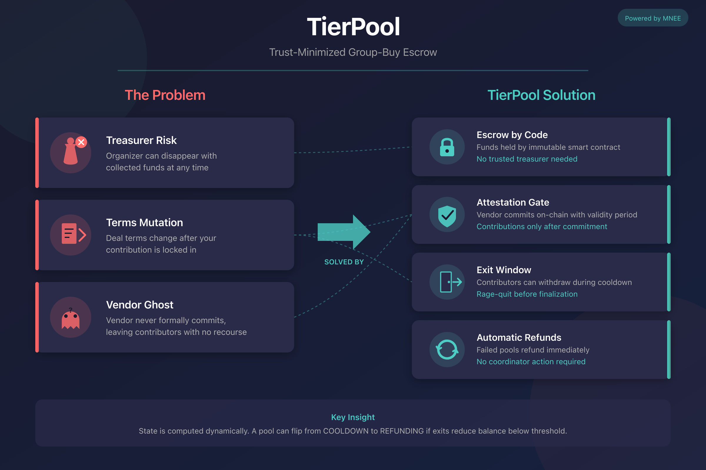
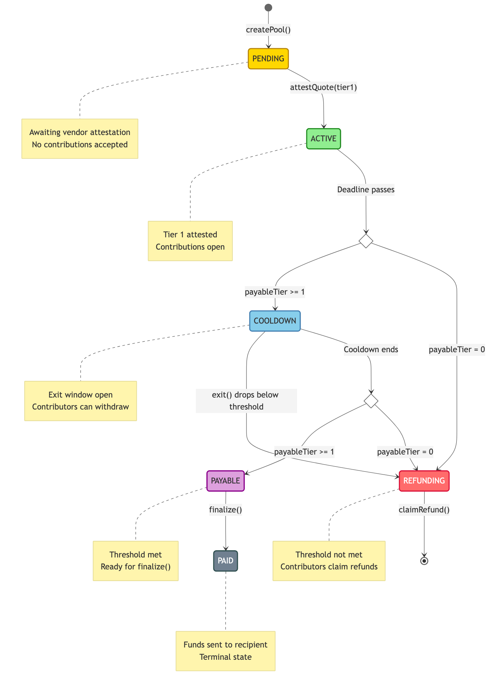
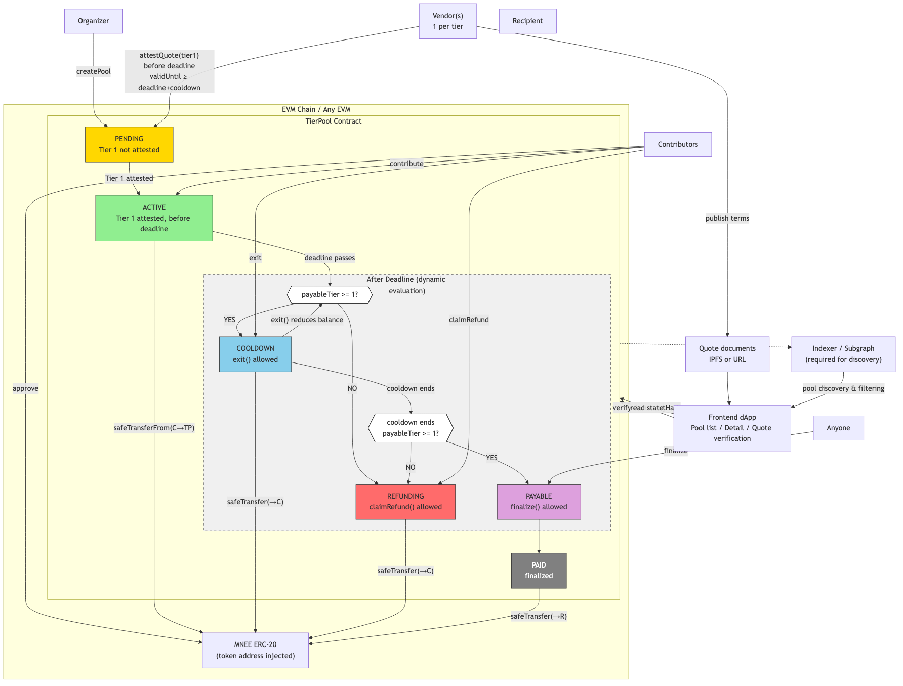

# TierPool

> Trust-minimized group-buy escrow with vendor attestation & exit protection

[]()
[]()
[]()



## Problem

Traditional group buys suffer from three critical failure modes:

| Failure Mode | Description | Impact |
|--------------|-------------|--------|
| **Treasurer Risk** | Organizer disappears with collected funds | Total loss of contributions |
| **Terms Mutation** | Deal terms change after contributions locked | Contributors stuck with unfavorable terms |
| **Vendor Ghost** | Vendor never formally commits to the deal | No accountability, no recourse |

## Solution

TierPool eliminates these risks through smart contract enforcement:

| Mechanism | How It Works |
|-----------|--------------|
| **Escrow by Code** | Funds held by immutable contract, not a trusted party |
| **Attestation Gate** | Contributions only accepted after vendor commits on-chain |
| **Exit Window** | Contributors can withdraw during cooldown period after deadline |
| **Automatic Refunds** | Failed pools refund immediately without coordinator action |

## How It Works



<details>
<summary>ASCII version</summary>

```
createPool() ──► PENDING ──── attestQuote(tier1) ──► ACTIVE
                                                       │
                                              deadline passes
                                                       │
                                                       ▼
                              ┌───── payableTier >= 1? ─────┐
                              │                             │
                             YES                           NO
                              ▼                             ▼
                           COOLDOWN ◄──────────────────► REFUNDING
                              │ ▲                           ▲
                              │ │ exit() drops              │
                              │ │ payableTier to 0          │
                              │ └───────────────────────────┘
                              │
                              │ cooldown ends
                              │
                              ├─── still payableTier >= 1? ──────┐
                              │                                  │
                             YES                                NO
                              ▼                                  │
                           PAYABLE ── finalize() ──► PAID        │
                                                                 │
                                      (merge to REFUNDING) ◄─────┘
```

</details>

**Key Insight:** State is evaluated dynamically. A pool can flip from COOLDOWN to REFUNDING if exits reduce totalRaised below Tier 1 threshold.

## Network & Demo

| Item | Value |
|------|-------|
| MNEE Token | `0x8ccedbAe4916b79da7F3F612EfB2EB93A2bFD6cF` |
| Demo Method | Local Anvil fork of Ethereum Mainnet |

> **Note:** MNEE token exists on Ethereum mainnet. Demo runs on a local fork with real MNEE contract state, using whale impersonation for funding test accounts.

## Quick Start

### Prerequisites

- [Foundry](https://book.getfoundry.sh/getting-started/installation)
- Ethereum RPC URL (e.g., `https://ethereum-rpc.publicnode.com`)

### Build & Test

```bash
# Clone repository
git clone https://github.com/<your-username>/TierPoolPub.git
cd TierPoolPub

# Install dependencies
forge install

# Build
forge build

# Run tests
forge test

# Run tests with gas report
forge test --gas-report
```

### Deploy (Local Fork)

```bash
# Start local Ethereum fork
anvil --fork-url https://ethereum-rpc.publicnode.com

# Deploy (new terminal) - use cast for reliable deployment
BYTECODE=$(forge inspect src/TierPool.sol:TierPool bytecode)
ARGS=$(cast abi-encode "constructor(address)" 0x8ccedbAe4916b79da7F3F612EfB2EB93A2bFD6cF | cut -c3-)
cast send --private-key 0xac0974bec39a17e36ba4a6b4d238ff944bacb478cbed5efcae784d7bf4f2ff80 \
  --rpc-url http://127.0.0.1:8545 --create "${BYTECODE}${ARGS}"
```

## Live Demo

Run the full demo script to see both happy path and refund scenarios:

```bash
# Terminal 1: Start local Ethereum fork
anvil --fork-url https://ethereum-rpc.publicnode.com

# Terminal 2: Deploy and run demo
BYTECODE=$(forge inspect src/TierPool.sol:TierPool bytecode)
ARGS=$(cast abi-encode "constructor(address)" 0x8ccedbAe4916b79da7F3F612EfB2EB93A2bFD6cF | cut -c3-)
TIERPOOL=$(cast send --private-key 0xac0974bec39a17e36ba4a6b4d238ff944bacb478cbed5efcae784d7bf4f2ff80 \
  --rpc-url http://127.0.0.1:8545 --create "${BYTECODE}${ARGS}" --json | jq -r '.contractAddress')

# Run demo (auto-detects MNEE whale)
TIERPOOL=$TIERPOOL ./script/demo.sh
```

> **Note:** If the script cannot find a whale with MNEE balance, manually specify one:
> ```bash
> # Find current whale addresses
> ./script/find-whale.sh
>
> # Or visit Etherscan directly
> # https://etherscan.io/token/0x8ccedbAe4916b79da7F3F612EfB2EB93A2bFD6cF#balances
>
> # Set whale address and run
> export MNEE_WHALE=<whale_address>
> TIERPOOL=$TIERPOOL ./script/demo.sh
> ```

### What the Demo Shows

1. **Happy Path**: Create pool → Vendor attests → Contributor funds → Finalize → Recipient receives MNEE
2. **Refund Path**: Create pool with unreachable threshold → Contributor funds → Deadline passes → Contributor claims refund

The demo script automatically:
- Impersonates a MNEE whale to fund test accounts
- Creates pools with different configurations
- Demonstrates all state transitions
- Shows successful payout and refund flows

## Quality Results

| Check | Status |
|-------|--------|
| Tests | 55/55 passing |
| Gas (contribute) | ~120k avg |
| Gas (finalize) | ~125k max |
| Slither | No high/medium severity findings |

### Key Gas Costs

| Function | Min | Avg | Max |
|----------|-----|-----|-----|
| createPool | 23,730 | 317,342 | 394,144 |
| attestQuote | 26,267 | 74,702 | 86,848 |
| contribute | 28,910 | 97,996 | 130,241 |
| exit | 35,609 | 53,437 | 75,026 |
| finalize | 30,872 | 75,518 | 125,277 |
| claimRefund | 35,543 | 58,450 | 91,054 |

## Security

- **ReentrancyGuard**: All state-changing functions protected
- **Balance Delta Accounting**: Handles fee-on-transfer tokens correctly
- **Access Control**: State-based gating on all operations
- **Comprehensive Tests**: 55 tests including reentrancy attack vectors


## Documentation

| Document | Description |
|----------|-------------|
| [SUBMISSION.md](./SUBMISSION.md) | Hackathon submission details |

## System Architecture



### Architecture Notes

| Aspect | Detail |
|--------|--------|
| **Dynamic State** | State is computed on every `getState()` call, not stored. COOLDOWN can flip to REFUNDING mid-cooldown if exits reduce balance below threshold or attestation expires. |
| **Chain Agnostic** | Token address injected via constructor. Deploy to any EVM chain with the target token. |
| **Indexer Required** | Pool discovery and filtering require an indexer (The Graph or custom). Direct RPC insufficient for list views. |
| **Multi-Vendor** | Each tier has its own designated vendor who must attest separately. |
| **Attestation Constraints** | Must occur before deadline with `validUntil >= deadline + cooldown`. Expired attestations zero out payable tier. |

## Project Structure

```
src/
└── TierPool.sol    # Main contract (482 lines)

script/
├── Deploy.s.sol    # Deployment script
└── demo.sh         # Interactive demo (happy path + refund)

test/
├── TierPool.t.sol           # Core functionality tests (36)
├── TierPoolAttestation.t.sol # Attestation tests (10)
├── TierPoolSecurity.t.sol    # Security tests (9)
└── helpers/
    ├── MockERC20.sol              # Standard mock
    ├── MockERC20WithCallback.sol  # Callback mock for reentrancy tests
    ├── MockFeeOnTransferToken.sol # FOT token mock
    └── ReentrantAttacker.sol      # Attack contract
```

## License

MIT
